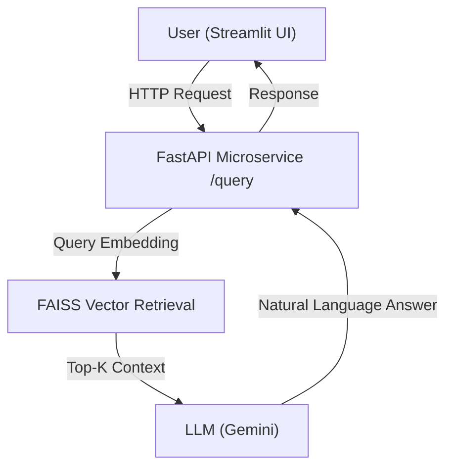

# RAG-Powered Insurance Claims Query Assistant

## 📖 Overview

The **RAG-Powered Insurance Claims Query Assistant** is an AI-driven system that enables insurance payer staff to query structured claims data using natural language. Instead of writing SQL or manually analyzing spreadsheets, users can ask questions such as:

> *"Show me denied claims for diabetes patients last quarter"*
> *"What are the common denial reasons for cardiology claims?"*
> *"What percentage of claims are approved?"*

The system combines ETL pipelines, vector-based semantic retrieval (RAG), and Large Language Models (LLMs) to generate accurate, explainable, and data-grounded responses.

---

## 🚀 Key Features

* **Natural Language Querying:** Interact with structured insurance claims data using plain English.
* **Retrieval-Augmented Generation (RAG):** Uses vector similarity search to find relevant records.
* **Evidence-Grounded Answers:** Responses include specific denial reasons, counts, and trends based strictly on the data.
* **Microservice Architecture:** FastAPI-based backend decoupled from the UI.
* **Interactive UI:** Lightweight Streamlit chatbot interface.
* **Containerized:** Fully deployable using Docker and Docker Compose.

---

## 🛠️ Tech Stack

* **Language:** Python
* **Backend:** FastAPI, Uvicorn
* **LLM:** Google Gemini
* **Vector Search:** FAISS
* **Embeddings:** Sentence-Transformers
* **Data Processing:** Pandas, NumPy
* **UI:** Streamlit
* **Deployment:** Docker, Docker Compose

---

## 🏗️ System Architecture

The system follows a microservice-first approach where the UI and Backend are separated.



## 📊 Dataset Creation

### Mock Data Design
Synthetic insurance claims data was generated to simulate real-world payer datasets. Each record includes:
* `claim_id`
* `patient_age`
* `disease` (e.g., Diabetes, Asthma, Hypertension)
* `speciality` (e.g., Cardiology, Endocrinology)
* `claim_amount`
* `claim_status` (APPROVED / DENIED)
* `denial_reason` (if denied)
* `service_date`, `submission_date`
* `hospital_name`, `payer_name`

### Dataset Size
* **1,000–5,000 rows** (configurable)
* Contains a realistic mix of approved and denied claims.
* Includes multiple denial patterns (pre-authorization, coverage limits, documentation issues).

---

## 🔄 ETL Pipeline

The ETL process is an offline preprocessing step that prepares data for retrieval and analytics.

### 1. Extract
Raw claims are loaded from CSV files using Pandas.

### 2. Transform
* Missing values are standardized.
* Date fields are normalized.
* **Narrative Conversion:** Structured claims are converted into LLM-friendly narrative text to improve semantic retrieval.

**Example:**
> "Claim CLM0123 involves a patient with Diabetes treated under Endocrinology. The claim amount was 45,000 INR and the claim was DENIED due to pre-authorization missing."

### 3. Load
Processed data is stored as Parquet files, acting as input for:
* FAISS index building
* Analytics computations
* Runtime retrieval

## 🧠 Embedding & Vector Indexing (RAG)

* **Embedding:** Narrative claim texts are converted into dense embeddings using `Sentence-Transformers`.
* **Indexing:** Embeddings are stored in a **FAISS vector index** for fast similarity search.
* **Metadata:** Claim metadata is stored alongside vectors for reconstruction after retrieval.

*This enables semantic matching between user queries and relevant claims, even when exact keywords do not match.*

---

## ⚡ FastAPI Backend

The backend is a stateless microservice handling request validation, retrieval, and LLM orchestration.

* **Endpoint:** `POST /query`

**Request Example:**
```json
{
  "query": "Show me denied claims for diabetes patients last quarter",
  "top_k": 25
}
```
**Response Example:**
```json
{
  "answer": "Based on the provided claims data, there were 12 denied claims..."
}
```

## 💻 Streamlit Chatbot UI

A lightweight interface for user interaction.

* Enables conversational querying.
* Displays answers in a chat format.
* Communicates with FastAPI via REST calls.

> **Note:** The UI is decoupled from backend logic, allowing future replacement with web or mobile frontends.

## 🐳 Deployment & Access

The system is deployed as two independent containers:
1.  **FastAPI RAG Service**
2.  **Streamlit UI**

### Run the System
```bash
docker-compose up --build
```

### Access Points
* **Chat UI:** [http://localhost:8501](http://localhost:8501)
* **API Documentation:** [http://localhost:8000/docs](http://localhost:8000/docs)

## 🔍 Sample Queries

Try asking the system:

> "Show denied claims for diabetes patients last quarter"

> "What are the common denial reasons in cardiology?"

> "Total claim activity for hypertension patients"

> "Percentage of claims that are approved"

---

## 📐 Design Principles

1.  **Separation of Concerns:** ETL, retrieval, inference, and UI are independent layers.
2.  **Evidence-Based AI:** LLM responses are strictly grounded in retrieved claims to minimize hallucinations.
3.  **Scalable Architecture:** Designed so FAISS can be replaced with a distributed Vector Database without major redesigns.
4.  **Microservice-First:** The backend is exposed via API, usable by any client.

---

## 🔮 Future Scope

The system is designed for extensibility. Future enhancements include:

### Intelligent Query Routing
Implement a query router (`router.py`) to classify user queries into:
* **Analytics queries:** Route directly to Pandas/SQL for aggregation (counts, rates).
* **RAG queries:** Route to FAISS for specific claim details.
* **General queries:** Route to LLM only.


### Other Enhancements
* **Vector DB:** Migrate from FAISS to **Qdrant** or **Pinecone** for distributed scale.
* **Caching:** Add **Redis** caching for repeated queries.
* **Security:** Implement **Role-Based Access Control (RBAC)**.
* **Observability:** Add metrics for retrieval quality and latency.
