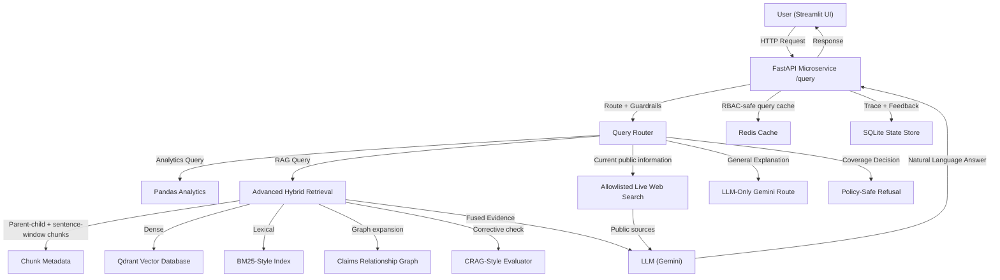

# RAG-Powered Insurance Claims Query Assistant

## 📖 Overview

The **RAG-Powered Insurance Claims Query Assistant** is an AI-driven system that enables insurance payer staff to query structured claims data using natural language. Instead of writing SQL or manually analyzing spreadsheets, users can ask questions such as:

> *"Show me denied claims for diabetes patients last quarter"*
> *"What are the common denial reasons for cardiology claims?"*
> *"What percentage of claims are approved?"*

The system combines ETL pipelines, vector-based semantic retrieval (RAG), and Large Language Models (LLMs) to generate accurate, explainable, and data-grounded responses.

---

## 🚀 Key Features

* **Natural Language Querying:** Interact with structured insurance claims data using plain English.
* **Advanced Retrieval-Augmented Generation (RAG):** Uses parent-child chunking, sentence-window context, query expansion, metadata filters, Qdrant dense vector search, lexical BM25-style search, reciprocal-rank fusion, CRAG-style corrective retrieval, graph relationship expansion, and optional reranking.
* **Evidence-Grounded Answers:** Responses include specific denial reasons, counts, and trends based strictly on the data.
* **Policy-Driven Query Routing:** A deterministic query planner selects exactly one source: low-cost `ANALYTICS` for claims aggregations, `RAG` for internal evidence, optional `WEB_SEARCH` for current public information, `LLM_ONLY` for general explanations, or `DECISION_HELP` for unsupported coverage decisions.
* **Production Controls:** RBAC API auth, row-level payer access, Redis query caching, request IDs, structured JSON logs, health/readiness checks, metrics, guardrails, SQLite feedback/audit storage, and request redaction.
* **Microservice Architecture:** FastAPI-based backend decoupled from the UI.
* **Interactive UI:** Lightweight Streamlit chatbot interface.
* **Containerized:** Deployable using Docker Compose and Render.

---

## 🛠️ Tech Stack

* **Language:** Python
* **Backend:** FastAPI, Uvicorn
* **LLM:** Google Gemini via the current Google GenAI SDK
* **Vector Search:** Qdrant plus lexical retrieval and RRF fusion
* **Embeddings:** Sentence-Transformers
* **Data Processing:** Pandas, NumPy
* **Persistence:** SQLite for conversations, feedback, retrieval traces, ingestion jobs, and audit events
* **Cache:** Redis for RBAC-safe query response caching
* **UI:** Streamlit
* **Deployment:** Render, Docker, Docker Compose

---

## 🏗️ System Architecture

The system follows a microservice-first approach where the UI and Backend are separated.


```mermaid
graph TD
    User["User (Streamlit UI)"] -->|HTTP Request| API["FastAPI Microservice /query"]
    API -->|Route + Guardrails| Router["Query Router"]
    Router -->|Analytics Query| Analytics["Pandas Analytics"]
    Router -->|RAG Query| Retrieval["Advanced Hybrid Retrieval"]
    Router -->|Current public information| Web["Allowlisted Live Web Search"]
    Router -->|General Explanation| GeneralLLM["LLM-Only Gemini Route"]
    Router -->|Coverage Decision| Refusal["Policy-Safe Refusal"]
    Retrieval -->|Parent-child + sentence-window chunks| Chunks["Chunk Metadata"]
    Retrieval -->|Dense| Qdrant["Qdrant Vector Database"]
    Retrieval -->|Lexical| BM25["BM25-Style Index"]
    Retrieval -->|Graph expansion| Graph["Claims Relationship Graph"]
    Retrieval -->|Corrective check| CRAG["CRAG-Style Evaluator"]
    Retrieval -->|Fused Evidence| LLM["LLM (Gemini)"]
    Web -->|Public sources| LLM
    API -->|RBAC-safe query cache| Redis["Redis Cache"]
    API -->|Trace + Feedback| SQLite["SQLite State Store"]
    LLM -->|Natural Language Answer| API
    API -->|Response| User
```

## 📊 Dataset Creation

### Mock Data Design
Synthetic insurance claims data was generated to simulate real-world payer datasets. Each record includes:
* `claim_id`
* `patient_age`
* `disease` (e.g., Diabetes, Asthma, Hypertension)
* `speciality` (e.g., Cardiology, Endocrinology)
* `claim_amount`
* `claim_status` (APPROVED / DENIED)
* `denial_reason` (if denied)
* `service_date`, `submission_date`
* `hospital_name`, `payer_name`

### Dataset Size
* **5,000 rows** by default (configurable)
* Contains a realistic mix of approved and denied claims.
* Includes multiple denial patterns (pre-authorization, coverage limits, documentation issues).
* Includes production-style fields such as diagnosis code, procedure code, plan type, network status, prior authorization flag, allowed amount, paid amount, deductible, copay, member state, and appeal status.

### Dataset Positioning
The default dataset is synthetic and acceptable for demonstrating a production-style RAG architecture. For more realistic public synthetic healthcare data, see:
* CMS SynPUF / DE-SynPUF
* CMS DE-SynPUF on AWS
* Synthea

Details are in `data/README.md`.

---

## 🔄 ETL Pipeline

The ETL process is an offline preprocessing step that prepares data for retrieval and analytics.

### 1. Extract
Raw claims are loaded from CSV files using Pandas.

### 2. Transform
* Missing values are standardized.
* Date fields are normalized.
* Required columns, duplicate claim IDs, controlled values, and numeric/date types are validated.
* **Narrative Conversion:** Structured claims are converted into LLM-friendly narrative text to improve semantic retrieval.
* A dataset manifest is written to `data/processed/dataset_manifest.json`.

**Example:**
> "Claim CLM0123 involves a patient with Diabetes treated under Endocrinology. The claim amount was 45,000 INR and the claim was DENIED due to pre-authorization missing."

### 3. Load
Processed data is stored as Parquet files, acting as input for:
* Qdrant vector collection building
* Analytics computations
* Runtime retrieval

## 🧠 Embedding & Vector Indexing (RAG)

This project uses a **production-style advanced hybrid RAG** strategy, not a single naive vector-search pattern.

* **Parent-Child Chunking:** Parent records are full claims; child records are sentence-level chunks used for precise matching.
* **Sentence-Window Retrieval:** Retrieved child sentences carry neighboring sentence context into the prompt, improving answer context without overloading retrieval.
* **Query Expansion:** Domain-safe deterministic expansions add synonyms such as denied/rejected/denial, prior authorization/preauthorization, and disease/code variants.
* **Metadata Filtering:** Status, disease, speciality, payer, denial reason, network, plan, provider, state, appeal, dates, and amounts are applied as Qdrant payload filters before dense retrieval and rechecked locally for defense in depth.
* **Dense Retrieval:** Sentence-Transformers embeddings are searched using Qdrant.
* **Lexical Retrieval:** BM25-style scoring handles exact terms, IDs, codes, payers, and denial phrases.
* **Reciprocal Rank Fusion:** Dense and lexical rankings are fused before evidence selection.
* **Cross-Encoder Reranking:** Optional reranking is available with `ENABLE_RERANKER=true`.
* **CRAG-Style Corrective Retrieval:** Retrieved evidence is scored for quality; weak retrieval can retry with relaxed filters and returns insufficient-evidence responses when confidence is low.
* **Claims Graph Context:** A lightweight structured graph connects claims by disease, payer, speciality, denial reason, network status, plan type, and provider type.

RRF scores are relative ordering values, not calibrated relevance probabilities. The API exposes `top_rrf_score`, `top_dense_score`, and `top_rerank_score` separately. Exact metadata record requests bypass semantic-confidence gating; unfiltered semantic requests use `MIN_DENSE_RELEVANCE_SCORE` (default `0.20`) for that gate.

### Retrieval Method Classification

Current method: **Advanced Hybrid RAG with Parent-Child + Sentence Window + Query Expansion + CRAG-style correction + structured GraphRAG-lite context**.

It is not currently a full Microsoft-style global GraphRAG system with LLM-extracted entity graphs, community detection, and community summaries. That style is more useful for long narrative corpora. For this tabular claims use case, structured graph expansion is more explainable and practical.

It is not tree-based RAG. Tree-based retrieval is generally better for hierarchical long documents, manuals, and summaries. Claims data benefits more from metadata filtering, exact lexical matching, parent-child chunks, and graph relationships.

### Scalability Position

The app is production-deployable for a synthetic-data demonstration: dense retrieval runs through Qdrant, metadata filters execute in Qdrant, API and UI are separate services, and analytics remains available when the vector store is unavailable.

To become enterprise-distributed, the next infrastructure step is:

* use managed Qdrant or another distributed vector DB in production
* move SQLite to Postgres
* move the guarded in-process FastAPI ingestion job to Celery/RQ workers for multi-instance or very large datasets
* store raw/processed datasets in object storage
* add production monitoring and tracing

The current lexical BM25-style ranker is in-process and scans the allowed candidate set. For truly large corpora, replace it with Qdrant sparse vectors or a dedicated lexical service such as Elasticsearch/OpenSearch. SQLite and the in-process ingestion lock are appropriate for a portfolio deployment, not a horizontally scaled PHI workload.

*This enables semantic matching between user queries and relevant claims, even when exact keywords do not match.*

---

## ⚡ FastAPI Backend

The backend is a stateless microservice handling request validation, retrieval, and LLM orchestration.

* **Endpoint:** `POST /query`

**Request Example:**
```json
{
  "query": "Show me denied claims for diabetes patients last quarter",
  "top_k": 25
}
```
**Response Example:**
```json
{
  "answer": "Based on the provided claims data, there were 12 denied claims...",
  "route": "RAG",
  "evidence": [],
  "filters": {},
  "retrieval_summary": {},
  "warnings": [],
  "conversation_id": "uuid",
  "request_id": "uuid"
}
```

### Additional Endpoints
* `GET /health` - liveness probe; always suitable for platform health checks
* `GET /ready` - data/vector readiness; reports `ready`, `degraded`, or `not_ready`
* `GET /metrics`
* `POST /feedback`
* `POST /ingestion/jobs`
* `GET /ingestion/jobs/{job_id}`

Set `RAG_API_KEY` to require `X-API-Key` on non-health endpoints. Analytics queries use Parquet claims data and do not require Qdrant; RAG queries return `503` while Qdrant is unavailable or an index rebuild is active. Every response includes `retrieval_summary.router`, which records the selected data source, decision reasons, and estimated cost/latency.

### Model-Driven Router And Guardrails
The router and input guardrails use the same compact, locally trained supervised text classifier. There are no regex route or guardrail rules. Its labels are `ANALYTICS`, `CLAIMS_RAG`, `WEB_SEARCH`, `LLM_ONLY`, `DECISION_HELP`, and three safety blocks for prompt injection, private-data extraction, and unsupported medical/legal advice.

The classifier emits a label, confidence, and model version. The router maps that label to exactly one source, recorded in `retrieval_summary.router`:

* `ANALYTICS` -> deterministic claims aggregation, without an LLM or vector search
* `CLAIMS_RAG` -> authorized internal hybrid retrieval
* `WEB_SEARCH` -> public web search only when explicitly configured
* `LLM_ONLY` -> Gemini with no claims or web access
* low confidence -> `LLM_ONLY`, with no internal or external data source opened

The compact model is trained from [versioned labeled examples](training/query_classifier_samples.jsonl) and bundled as `models/query_classifier.joblib`. Retrain it after adding reviewed feedback labels:

```bash
.venv/bin/python -m training.train_query_classifier
.venv/bin/python eval/evaluate_query_classifier.py
```

This avoids multi-index fan-out and a separate paid LLM classification call. Public web search remains disabled by default; enable it with `WEB_SEARCH_PROVIDER=tavily` and `TAVILY_API_KEY`, then optionally restrict sources through `WEB_SEARCH_ALLOWED_DOMAINS=cms.gov,medicare.gov`.

### RBAC And Row-Level Access
Configure users with `RAG_RBAC_USERS`:

```json
[
  {
    "api_key": "manager-key",
    "user_id": "claims-manager",
    "role": "claims_manager",
    "allowed_payers": ["*"]
  },
  {
    "api_key": "payer-a-key",
    "user_id": "payer-a-analyst",
    "role": "analyst",
    "allowed_payers": ["MediPlus"]
  }
]
```

Roles:
* `admin`: query, metrics, ingestion, all payers
* `claims_manager`: query, metrics, ingestion, configured payers
* `analyst`: query and feedback only, configured payers

### Redis Query Cache
Set `REDIS_URL` to enable query response caching. Cache keys include user ID, role, allowed payers, query, top-k, route, filters, and Qdrant collection, so cached evidence cannot leak across RBAC scopes. Ingestion jobs invalidate cached query responses.

## 💻 Streamlit Chatbot UI

A lightweight interface for user interaction.

* Enables conversational querying.
* Displays answers in a chat format.
* Communicates with FastAPI via REST calls.

> **Note:** The UI is decoupled from backend logic, allowing future replacement with web or mobile frontends.

## 🐳 Deployment & Access

The system is deployed as two independent containers:
1.  **FastAPI RAG Service**
2.  **Streamlit UI**

### Run the System
Create a local environment file on first setup:
```bash
cp .env.example .env
```

```bash
docker compose up --build
```

On a fresh Qdrant volume, build the collection once after the API is running:

```bash
curl -X POST http://localhost:8000/ingestion/jobs \
  -H "X-API-Key: change-this-local-api-key" \
  -H "Content-Type: application/json" \
  -d '{"regenerate_data": false, "rebuild_index": true}'
```

Poll `GET /ready` until the retriever reports `ready`. Replace the example key with the value in your local `.env`.

### Access Points
* **Chat UI:** [http://localhost:8501](http://localhost:8501)
* **API Documentation:** [http://localhost:8000/docs](http://localhost:8000/docs)

### Local Pipeline
```bash
uv venv .venv --python 3.11
uv pip install --python .venv/bin/python -r requirements.txt
.venv/bin/python generate_mock_data.py
.venv/bin/python -m etl.etl_pipeline
.venv/bin/python -m rag.build_index
.venv/bin/python -m training.train_query_classifier
.venv/bin/uvicorn api.main:app --reload
.venv/bin/streamlit run ui_app.py
```

### Evaluation
```bash
pytest
python3 -m eval.evaluate_retrieval
python3 -m eval.evaluate_query_classifier
```

## 🔍 Sample Queries

Try asking the system:

> "Show denied claims for diabetes patients last quarter"

> "What are the common denial reasons in cardiology?"

> "Total claim activity for hypertension patients"

> "Percentage of claims that are approved"

> "What percentage of diabetes claims are denied?"

> "What is prior authorization?"

---

## 📐 Design Principles

1.  **Separation of Concerns:** ETL, retrieval, inference, and UI are independent layers.
2.  **Evidence-Based AI:** LLM responses are strictly grounded in retrieved claims to minimize hallucinations.
3.  **Scalable Architecture:** Uses Qdrant for vector retrieval and Redis for cacheable query responses.
4.  **Microservice-First:** The backend is exposed via API, usable by any client.

---

## 🔮 Future Scope

The system is designed for extensibility. Future enhancements include:

### Other Enhancements
* **Distributed ingestion:** Move the current single-process, lock-protected FastAPI job to Celery/RQ workers with Postgres-backed job state for larger datasets.
* **State store:** Move local SQLite state to Postgres before real PHI-like use.
* **Fine-tuning:** Use collected feedback and eval traces before considering model fine-tuning.
